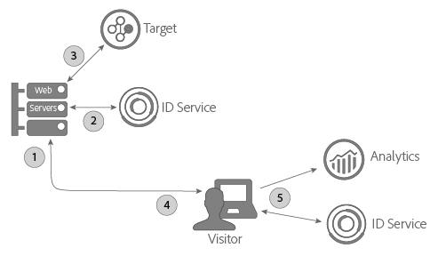
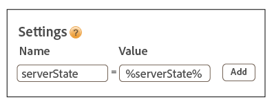

# Uso del servizio ID con A4T e l&#39;implementazione lato server di Target {#using-the-id-service-with-a-t-and-a-server-side-implementation-of-target}

Queste istruzioni sono per i clienti A4T con implementazioni miste lato server e client di Target, Analytics e del servizio ID. Dovranno essere consultate anche dai clienti che devono eseguire il servizio ID in un ambiente NodeJS o Rhino. Questa istanza del servizio ID utilizza una versione ridotta della libreria di codici VisitorAPI.js, che puoi scaricare e installare da Node Package Manager (NPM). Leggi questa sezione per le istruzioni di installazione e altri requisiti di configurazione.

## Introduzione {#section-ab0521ff5bbd44c592c3eaab31c1de8b}

I clienti A4T (e altri clienti) possono utilizzare questa versione del servizio ID per svolgere le seguenti funzioni:

* Eseguire il rendering del contenuto della pagina web sui propri server e trasmetterlo a un browser per la visualizzazione finale.
* Effettuare chiamate [!DNL Target] lato server.
* Effettuare chiamate ad [!DNL Analytics] lato client (nel browser).
* Sincronizzare diversi ID di [!DNL Target] ed [!DNL Analytics] per determinare se due visitatori rilevati rispettivamente dalle due soluzioni sono in realtà la stessa persona.

## Download del codice e interfacce fornite {#section-32d75561438b4c3dba8861be6557be8a}

Per scaricare il pacchetto di codice lato server e rivedere le interfacce incluse nella build corrente, vai all’[archivio NPM del servizio ID](https://www.npmjs.com/package/@adobe-mcid/visitor-js-server).

## Flusso di lavoro {#section-56b01017922046ed96536404239a272b}

Il diagramma e le sezioni seguenti descrivono cosa accade e cosa devi configurare in ciascuna fase del processo di implementazione lato server.



## Passaggio 1: richiesta della pagina {#section-c12e82633bc94e8b8a65747115d0dda8}

L&#39;attività lato server inizia quando un visitatore effettua una richiesta HTTP per caricare una pagina Web. Il server riceve la richiesta e controlla il [Cookie AMCV](../introduction/cookies.md). Il cookie AMCV contiene l&#39;identificatore [!DNL Experience Cloud] ID (MID) del visitatore.

## Passaggio 2: generazione del payload del servizio ID {#section-c86531863db24bd9a5b761c1a2e0d964}

Successivamente, devi effettuare una richiesta lato server *`payload request`* al servizio ID. Una richiesta di payload:

* passa il cookie AMCV al servizio ID;
* richiede i dati richiesti da Target e Analytics nei passaggi successivi descritti di seguito.

>[!NOTE]
>
>Questo metodo richiede un singolo mbox da [!DNL Target]. Se hai bisogno di richiedere più mbox in una singola chiamata, consulta [generateBatchPayload](https://www.npmjs.com/package/@adobe-mcid/visitor-js-server#generatebatchpayload).

Di seguito puoi vedere un esempio di codice per la richiesta di payload. Nel codice di esempio, la funzione `visitor.setCustomerIDs` è opzionale. Consulta [ID cliente e stati di autenticazione](../reference/authenticated-state.md) per ulteriori informazioni.

```js
//Import the ID service server package 
var Visitor = require("@adobe-mcid/visitor-js-server"); 
 
//Pass in your Organization ID to instantiate Visitor 
var visitor = new Visitor("Insert Experience Cloud ID here"); 
 
// 
<i>(Optional)</i> Set a custom customer ID 
visitor.setCustomerIDs({ 
     userid:{ 
          id:"1234", 
          authState: Visitor.AuthState.UNKNOWN //AuthState is a static property of the Visitor class 
     } 
}); 
 
//Parse the visitor's HTTP request for the AMCV cookie 
var cookies = cookie.parse(req.headers.cookie || ""); 
var cookieName = visitor.getCookieName(); // Visitor API that returns the cookie name. 
var amcvCookie = cookies[cookieName]; 
 
//Generate the payload request pass your mbox name and the AMCV cookie if present 
var visitorPayload = visitor.generatePayload({ 
     mboxName: "bottom-banner-mbox", 
     amcvCookie: amcvCookie 
});
```

Il servizio ID restituisce il payload in un oggetto JSON, simile all&#39;esempio di seguito. I dati di payload sono necessari per [!DNL Target].

```js
{ 
    "marketingCloudVisitorId": "02111696918527575543455026275721941645", 
    "mboxParameters": { 
        "mboxAAMB": "abcd1234", 
        "mboxMCGLH": "9", 
        "mboxMCSDID": "56BE026543F7E211-1CC51BCAAE88F0D2", 
        "vst.userid.id": "1234567890", 
        "vst.userid.authState": 0 
    } 
}
```

Se il visitatore non ha un cookie AMCV, il payload omette queste coppie chiave-valore:

* `marketingCloudvisitorId`
* `mboxAAMB`
* `mboxMCGLH`

## Passaggio 3: aggiunta del payload alla chiamata Target {#section-62451aa70d2f44ceb9fd0dc2d4f780f7}

Una volta che il server ha ricevuto i dati di payload dal servizio ID, devi creare un&#39;istanza di codice aggiuntivo per unirli ai dati passati a [!DNL Target]. L&#39;oggetto JSON finale passato a [!DNL Target] sarà simile all&#39;esempio di seguito:

```js
{ 
"mbox" : "target-global-mbox", 
"marketingCloudVisitorId":"02111696918527575543455026275721941645", 
"requestLocation" : { 
     "pageURL" : "http://www.domain.com/test/demo.html", 
     "host" : "localhost:3000" 
     }, 
"mboxParameters" : { 
     "mboxAAMB" : "abcd1234", 
     "mboxMCGLH" : "9", 
     "mboxMCSDID": "56BE026543F7E211-1CC51BCAAE88F0D2", 
     "vst.userid.id": "1234567890", 
     "vst.userid.authState": 0, 
     } 
} 
```

## Passaggio 4: ottenimento dello stato del server per il servizio ID {#section-8ebfd177d42941c1893bfdde6e514280}

I dati sullo stato del server contengono informazioni sul lavoro eseguito sul server. Il codice del servizio ID lato client richiede queste informazioni. I clienti che hanno implementato il servizio ID tramite [!DNL Dynamic Tag Manager] possono configurare Dynamic Tag Management per passare i dati sullo stato del server tramite tale strumento. Se hai impostato il servizio ID tramite una procedura non standard, dovrai fornire tu stesso il codice necessario per restituire lo stato del server. Il codice per il servizio ID lato client e [!DNL Analytics] trasmette ad Adobe i dati sullo stato del server al momento del caricamento della pagina.

**Ottenere lo stato del server tramite Dynamic Tag Management**

Se hai implementato il servizio ID con Dynamic Tag Management, devi aggiungere il codice alla pagina e specificare una coppia nome-valore nelle impostazioni Dynamic Tag Management.

**Codice per la pagina**

Aggiungi questo codice al tag `<head>` della pagina HTML:

```js
//Get server state 
var serverState = visitor.getState(); 
 
Response.send(" 
... 
<head> 
     <script> 
          //Add 'serverState' as a stringified JSON global variable. 
          "var serverState = "+ JSON.stringify(serverState) +";  
     </script> 
     <script src = "DTM script (satellite JS)"> 
     </script> 
</head> 
...
```

**Impostazioni di Dynamic Tag Management**

Aggiungi queste coppie nome-valore alla sezione **[!UICONTROL Generali > Impostazioni]** della tua istanza del servizio ID:

* **[!UICONTROL Nome:]** serverState
* **[!UICONTROL Valore:]** %serverState%

   >[!IMPORTANT]
   >
   >Il nome del valore deve corrispondere al nome della variabile impostato per `serverState` nel codice della pagina.

Le impostazioni modificate saranno simili all&#39;esempio di seguito:



Consulta anche [Impostazioni del servizio Experience Cloud Identity per DTM](../implementation-guides/standard.md#concept-fb6cb6a0e6cc4f10b92371f8671f6b59).

**Ottenere lo stato del server senza DTM**

Se hai implementato il servizio ID in modo non standard, devi configurare questo codice da eseguire sul server mentre viene assemblata la pagina richiesta:

```js
//Get server state 
var serverState = visitor.getState(); 
 
Response.send(" 
... 
<head> 
     <script src="VisitorAPI.js"></script> 
     <script> 
          var visitor = Visitor.getInstance(orgID, { 
          serverState: serverState  
          ... 
     </script> 
</head> 
...
```

## Passaggio 5: serving di una pagina e restituzione di dati Experience Cloud {#section-4b5631a0d75a41febd6f43f8c214c263}

A questo punto, il server Web invia il contenuto della pagina al browser del visitatore. Da questo punto in poi, è il browser (e non il server) ad effettuare tutte le restanti chiamate al servizio ID e [!DNL Analytics]. Ad esempio, nel browser:

* Il servizio ID riceve i dati sullo stato dal server e trasmette il codice SDID ad AppMeasurement.
* AppMeasurement invia i dati sul hit della pagina ad [!DNL Analytics], incluso l&#39;identificatore SDID.
* [!DNL Analytics] e [!DNL Target] confrontano gli identificatori SDID del visitatore. Se l&#39;identificatore SDID è identico, [!DNL Target] e [!DNL Analytics] uniscono le chiamate lato server e lato client. A questo punto, entrambe le soluzioni riconoscono il visitatore come la stessa persona.

>[!MORELIKETHIS]
>
>* [Pacchetto del servizio ID lato server da Node Package Manager](https://www.npmjs.com/package/@adobe-mcid/visitor-js-server)

