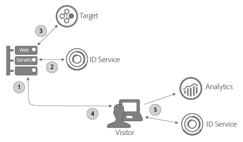

# Uso del servizio ID visitatori con A4T e l&#39;implementazione lato server di Target {#using-the-id-service-with-a-t-and-a-server-side-implementation-of-target}

Queste istruzioni sono per i clienti A4T con implementazioni miste lato server e client di Target, Analytics e il servizio ID visitatori. Anche i clienti che devono eseguire il servizio ID visitatore in un ambiente NodeJS o Rhino devono consultare queste informazioni. Questa istanza del servizio ID visitatori utilizza una versione ridotta della libreria di codici `VisitorAPI.js`, che puoi scaricare e installare da Node Package Manager (NPM). Leggi questa sezione per le istruzioni di installazione e altri requisiti di configurazione.

## Introduzione {#section-ab0521ff5bbd44c592c3eaab31c1de8b}

A4T (e altri clienti) possono utilizzare questa versione del servizio ID visitatore quando devono:

* Eseguire il rendering del contenuto della pagina web sui propri server e trasmetterlo a un browser per la visualizzazione finale.
* Effettuare chiamate Target lato server.
* Eseguire chiamate ad Analytics lato client (nel browser).
* Sincronizza diversi ID di Target e Analytics per determinare se un visitatore visualizzato da una soluzione è la stessa persona visualizzata dall&#39;altra soluzione.

## Download del codice e interfacce fornite {#section-32d75561438b4c3dba8861be6557be8a}

Per scaricare il pacchetto di codice lato server e rivedere le interfacce incluse nella build corrente, vai all&#39;archivio NPM del [Servizio ID visitatore](https://www.npmjs.com/package/@adobe-mcid/visitor-js-server).

## Flusso di lavoro {#section-56b01017922046ed96536404239a272b}

Il diagramma e le sezioni seguenti descrivono cosa accade e cosa devi configurare in ciascuna fase del processo di implementazione lato server.



## Passaggio 1: richiesta della pagina {#section-c12e82633bc94e8b8a65747115d0dda8}

L&#39;attività lato server inizia quando un visitatore effettua una richiesta HTTP per caricare una pagina Web. Durante questo passaggio, il server riceve questa richiesta e verifica la presenza del cookie [AMCV](../introduction/cookies.md). Il cookie AMCV contiene l&#39;identificatore ECID del visitatore.

## Passaggio 2: generare il payload del servizio ID visitatore {#section-c86531863db24bd9a5b761c1a2e0d964}

Successivamente, devi effettuare un *`payload request`* lato server al servizio ID visitatori. Una richiesta di payload:

* Trasmette il cookie AMCV al servizio ID visitatore.
* richiede i dati richiesti da Target e Analytics nei passaggi successivi descritti di seguito.

>[!NOTE]
>
>Questo metodo richiede un singolo mbox da Target. Se hai bisogno di richiedere più mbox in una singola chiamata, consulta [generateBatchPayload](https://www.npmjs.com/package/@adobe-mcid/visitor-js-server#generatebatchpayload).

Di seguito puoi vedere un esempio di codice per la richiesta di payload. Nel codice di esempio, la funzione `visitor.setCustomerIDs` è opzionale. Consulta [ID cliente e stati di autenticazione](../reference/authenticated-state.md) per ulteriori informazioni.

```js
//Import the Visitor ID Service server package 
var Visitor = require("@adobe-mcid/visitor-js-server"); 
 
//Pass in your IMS org ID to instantiate Visitor 
var visitor = new Visitor("Insert ECID here"); 
 
// 
<i>(Optional)</i> Set a custom customer ID 
visitor.setCustomerIDs({ 
     userid:{ 
          id:"1234", 
          authState: Visitor.AuthState.UNKNOWN //AuthState is a static property of the Visitor class 
     } 
}); 
 
//Parse the visitor's HTTP request for the AMCV cookie 
var cookies = cookie.parse(req.headers.cookie || ""); 
var cookieName = visitor.getCookieName(); // Visitor API that returns the cookie name. 
var amcvCookie = cookies[cookieName]; 
 
//Generate the payload request pass your mbox name and the AMCV cookie if present 
var visitorPayload = visitor.generatePayload({ 
     mboxName: "bottom-banner-mbox", 
     amcvCookie: amcvCookie 
});
```

Il Servizio ID visitatore restituisce il payload in un oggetto JSON simile all’esempio seguente. I dati di payload sono richiesti da Target.

```js
{ 
    "marketingCloudVisitorId": "02111696918527575543455026275721941645", 
    "mboxParameters": { 
        "mboxAAMB": "abcd1234", 
        "mboxMCGLH": "9", 
        "mboxMCSDID": "56BE026543F7E211-1CC51BCAAE88F0D2", 
        "vst.userid.id": "1234567890", 
        "vst.userid.authState": 0 
    } 
}
```

Se il visitatore non ha un cookie AMCV, il payload omette queste coppie chiave-valore:

* `marketingCloudvisitorId`
* `mboxAAMB`
* `mboxMCGLH`

## Passaggio 3: aggiunta del payload alla chiamata Target {#section-62451aa70d2f44ceb9fd0dc2d4f780f7}

Dopo che il server ha ricevuto i dati di payload dal servizio ID visitatore, devi creare un&#39;istanza di codice aggiuntivo per unirli ai dati passati a Target. L’oggetto JSON finale passato a Target sarà simile al seguente:

```js
{ 
"mbox" : "target-global-mbox", 
"marketingCloudVisitorId":"02111696918527575543455026275721941645", 
"requestLocation" : { 
     "pageURL" : "http://www.domain.com/test/demo.html", 
     "host" : "localhost:3000" 
     }, 
"mboxParameters" : { 
     "mboxAAMB" : "abcd1234", 
     "mboxMCGLH" : "9", 
     "mboxMCSDID": "56BE026543F7E211-1CC51BCAAE88F0D2", 
     "vst.userid.id": "1234567890", 
     "vst.userid.authState": 0, 
     } 
} 
```

## Passaggio 4: ottenimento dello stato del server per il servizio ID visitatore {#section-8ebfd177d42941c1893bfdde6e514280}

I dati sullo stato del server contengono informazioni sul lavoro eseguito sul server. Il codice del servizio ID visitatore lato client richiede queste informazioni. Se hai impostato il Servizio ID visitatore tramite un processo non standard, dovrai restituire lo stato del server con il tuo codice. Il codice Analytics e il servizio ID visitatori lato client trasmettono i dati sullo stato ad Adobe al caricamento della pagina.

Se hai implementato il servizio ID visitatori in modo non standard, devi configurare questo codice in modo che venga eseguito sul server mentre viene assemblata la pagina richiesta:

```js
//Get server state 
var serverState = visitor.getState(); 
 
Response.send(" 
... 
<head> 
     <script src="VisitorAPI.js"></script> 
     <script> 
          var visitor = Visitor.getInstance(orgID, { 
          serverState: serverState  
          ... 
     </script> 
</head> 
...
```

## Passaggio 5: serving di una pagina e restituzione di dati aziendali CX {#section-4b5631a0d75a41febd6f43f8c214c263}

A questo punto, il server Web invia il contenuto della pagina al browser del visitatore. Da questo punto in poi, il browser (non il server) effettua tutte le restanti chiamate al servizio ID visitatore e ad Analytics. Ad esempio, nel browser:

* Il Servizio ID visitatore riceve i dati sullo stato dal server e trasmette il codice SDID ad AppMeasurement.
* AppMeasurement invia ad Analytics i dati sul hit pagina, incluso l’identificatore SDID.
* Analytics e Target confrontano gli identificatori SDID del visitatore. Con un SDID identico, Target e Analytics uniscono le chiamate lato server e lato client. A questo punto, entrambe le soluzioni riconoscono il visitatore come la stessa persona.

>[!MORELIKETHIS]
>
>* [Pacchetto del servizio ID visitatori lato server da Node Package Manager](https://www.npmjs.com/package/@adobe-mcid/visitor-js-server)

