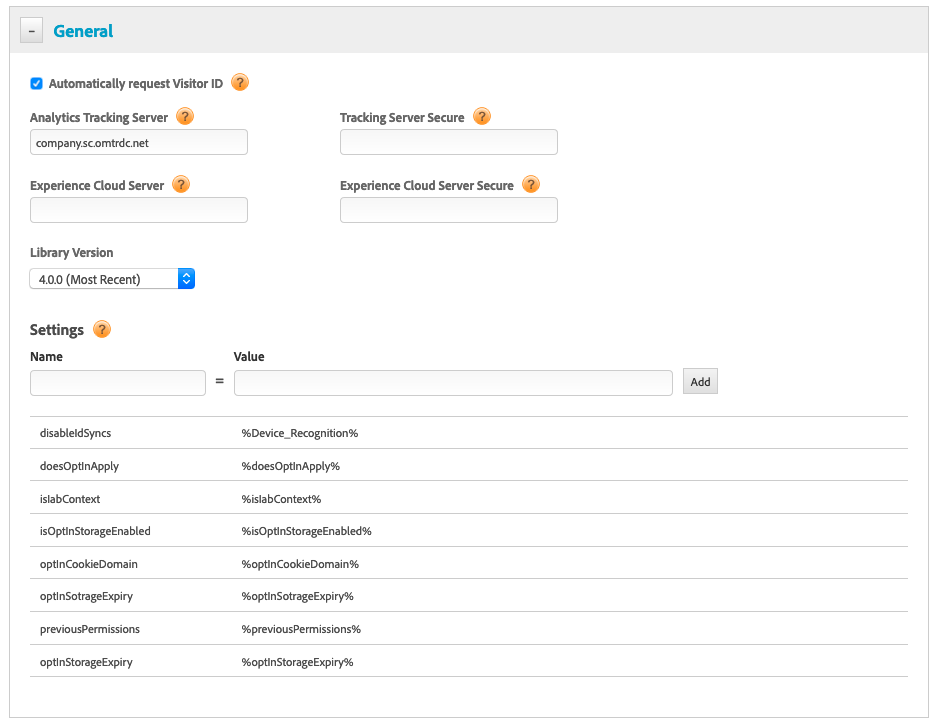

# Configurare Opt-in con DTM{#configuring-opt-in-with-dtm}

Abilitare il servizio Opt-in usando Dynamic Tag Management (DTM).

Configurare il servizio Opt-in usando DTM.

Obbligatorio:

* Effettuare l’aggiornamento alla versione 4.0.0 di ECID o successiva. Visita la pagina dei [download di ECID](https://github.com/Adobe-Marketing-Cloud/id-service/releases).

Inserire i [campi di configurazione](/help/implementation-guides/opt-in-service/api.md) nella pagina Generale di DTM.

