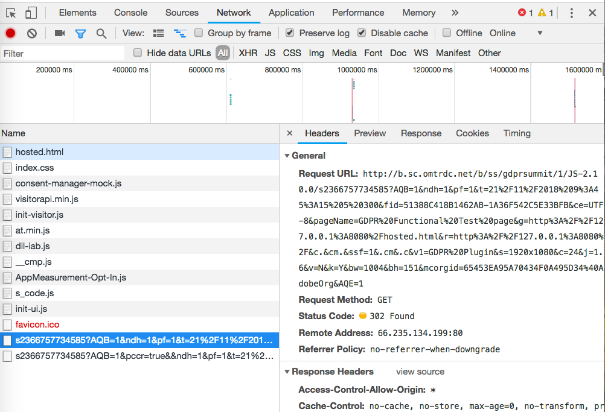

# Convalida del servizio Opt-in{#validating-opt-in-service}

Dopo aver abilitato l&#39;oggetto Opt-in sul sito Web, usa i metodi di convalida per verificare che il servizio funzioni come previsto usando gli strumenti per sviluppatori nel browser.

## Caso d&#39;uso 1: abilitare Opt-in {#section-c8fe1ee3711b420c8186c7057abbecb3}

```
Visitor.getInstance({{YOUR_ORG_ID}}, { 
    doesOptInApply: true 
});
```


Prima di caricare la pagina, svuota la cache e cancella i cookie.

In Chrome fai clic con il pulsante destro del mouse sulla pagina Web e seleziona Controlla. Come nella schermata in alto, seleziona la scheda *Rete* per visualizzare le richieste fatte dal browser.

Nell&#39;esempio sopra, i seguenti tag di Adobe JS sono installati sulla pagina: ECID, AAM, Analytics e Target.

**Come verificare che Opt-in funzioni come previsto:**

Nei server di Adobe non dovrebbe essere presente alcuna richiesta:

* demdex.net/id
* demdex.net/event
* omtrdc.net/b/ss
* omtrdc.net/m2
* everesttech.net

>[!NOTE]
>
>È possibile che venga visualizzata una chiamata a `http://dpm.demdex.net/optOutStatus`; si tratta di un endpoint di SOLA LETTURA usato per recuperare lo stato di Opt-out del visitatore. Questo endpoint non comporterà la creazione di un cookie di terze parti e non raccoglierà alcuna informazione dalla pagina.

Non dovrebbe essere visualizzato alcun cookie creato dai tag di Adobe: (AMCV_{{YOUR_ORG_ID}}, mbox, demdex, s_cc, s_sq, everest_g_v2, everest_session_v2)

In Chrome, passa alla scheda *Applicazione*, espandi la sezione *Cookie* in *Archiviazione* e seleziona il nome di dominio del tuo sito Web:


## Caso d&#39;uso 2: abilitare Opt-in e l&#39;archiviazione  {#section-bd28326f52474fa09a2addca23ccdc0f}

```
Visitor.getInstance({{YOUR_ORG_ID}}, { 
    doesOptInApply: true, 
    isOptInStorageEnabled: true 
});
```

L&#39;unica differenza nel caso d&#39;uso 2 è che verrà visualizzato *un nuovo cookie* che conterrà le autorizzazioni Opt-in fornite dal visitatore: **adobeujs-optin**

## Caso d&#39;uso 3: abilitare Opt-in e preapprovare Adobe Analytics  {#section-257fe582b425496cbf986d0ec12d3692}

```
var preApproveAnalytics = {}; 
preApproveAnalytics[adobe.OptInCategories.ANALYTICS] = true;

Visitor.getInstance({{YOUR_ORG_ID}}, { 
    doesOptInApply: true, 
    preOptInApprovals: preApproveAnalytics 
});
```

Poiché Adobe Analytics viene approvato prima di Opt-in, verranno visualizzate le richieste della scheda Rete nel server di monitoraggio:



e i cookie di Analytics nella scheda Applicazione:


## Caso d&#39;uso 4: abilitare Opt-in e IAB  {#section-64331998954d4892960dcecd744a6d88}

```
Visitor.getInstance({{YOUR_ORG_ID}}, { 
    doesOptInApply: true, 
    isIabContext: true 
});
```

**Come visualizzare il consenso IAB attuale sulla pagina:**

Apri gli strumenti per sviluppatori e seleziona la scheda *Console*. Incolla il seguente frammento di codice e premi INVIO:

```
<codeblock>
  __cmp("getVendorConsents", null, function (vendorConsents) { 
     console.log("Vendor Consent:", vendorConsents); }) 
</codeblock>  
  
```

Ecco un output di esempio generato quando vengono approvati gli scopi 1, 2 e 5 e l&#39;ID fornitore di Audience Manager:

* demdex.net/id: la presenza di questa chiamata dimostra che ECID ha richiesto un ID a demdex.net/id
* demdex.net/event: la presenza di questa chiamata dimostra che la chiamata della raccolta dati DIL funziona come previsto.
* demdex.net/dest5.html: la presenza di questa chiamata dimostra che vengono attivate le sincronizzazioni degli ID.


Non verrà visualizzata alcuna richiesta ai server di Adobe, né alcun cookie di Adobe se uno dei seguenti elementi non è valido:

* Gli scopi 1, 2 o 5 non vengono approvati.
* L&#39;ID fornitore di Audience Manager non viene approvato.