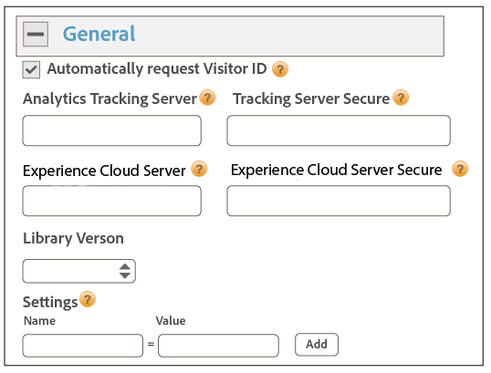
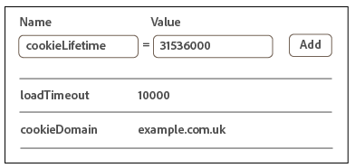
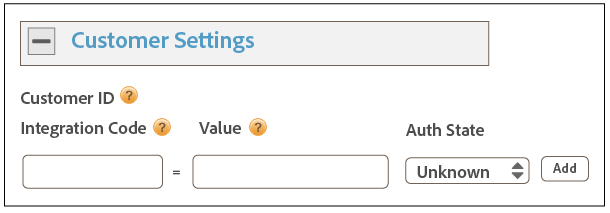

# Implementazione con Dynamic Tag Management {#implementation-with-dynamic-tag-management}

Le implementazioni meno recenti usano Dynamic Tag Management (DTM) per configurare, distribuire e integrare il servizio Experience Cloud Identity con le altre soluzioni Experience Cloud.

## Implementazione con Dynamic Tag Management {#topic-6f4ed5d96977406ca991e50f3fbd5b01}

Le implementazioni meno recenti usano Dynamic Tag Management (DTM) per configurare, distribuire e integrare il servizio Experience Cloud Identity con le altre soluzioni Experience Cloud.

>[!NOTE]
>
>Al momento, [Adobe Experience Platform Launch](https://experienceleague.adobe.com/docs/launch/using/home.html?lang=it) è lo strumento di implementazione preferito e consigliato perché consente di semplificare attività di gestione dei tag complesse e automatizza il posizionamento del codice oltre le funzionalità di DTM. Vedi [Implementare con Launch](../implementation-guides/ecid-implement-with-launch.md).

## Dynamic Tag Management e servizio ID {#section-4a4c4fac5d0a4cbbaff8e1833f73657c}

[Dynamic Tag Management](https://experienceleague.adobe.com/docs/dtm/using/dtm-home.html?lang=it) consente di configurare, implementare e gestire la tua istanza del servizio ID e le relative integrazioni di soluzioni [!DNL Experience Cloud]. DTM semplifica il processo di implementazione grazie alla stretta integrazione con il servizio ID e altre soluzioni Experience Cloud. È sufficiente aggiungere e configurare lo strumento Experience Cloud ID e specificare informazioni quali:

* ID organizzazione Experience Cloud (popolato automaticamente se collegato a Experience Cloud)
* Server di tracciamento di Analytics (protetto e non protetto)
* Server Experience Cloud (per server di tracciamento di prime parti)

DTM è disponibile gratuitamente per tutti i clienti di [!DNL Experience Cloud].

**Guida introduttiva a Dynamic Tag Management**

DTM è uno strumento semplice ma potente. Se non lo stai già utilizzando, ti invitiamo caldamente a farlo. Per informazioni introduttive su questo servizio, consulta la [Documentazione di DTM](https://experienceleague.adobe.com/docs/dtm/using/c-overview.html?lang=it). Per istruzioni su come impostare il servizio ID con Dynamic Tag Management, leggi le informazioni e procedure riportate di seguito.

## Linee guida per l&#39;implementazione {#concept-54a2ec49af8f4bfca9207b1d404e8e1a}

Leggi i requisiti e le procedure seguenti prima di provare a implementare il servizio Experience Cloud Identity con Dynamic Tag Management (DTM).

<!--
mcvid-dtm-deployment.xml
-->

**Provisioning dell&#39;account**

Prima di iniziare, assicurati che sia stato fatto il provisioning dell&#39;organizzazione e delle soluzioni per [!DNL Experience Cloud] e acquisisci familiarità con [!DNL Dyanamic Tag Management]. Questa documentazione rappresenta un buon punto di partenza:

* [Abilita le tue soluzioni per i servizi di base](https://experienceleague.adobe.com/docs/core-services/interface/services/core-services.html?lang=it): implementa Experience Cloud e diventa amministratore. Questa procedura consente di modernizzare le soluzioni per i servizi di base come gli attributi del cliente e Experience Cloud Audiences.
* [Guida introduttiva di Dynamic Tag Management](https://experienceleague.adobe.com/docs/dtm/using/getting-started/get-started.html?lang=it).

**Inserimento e ordine di caricamento del codice del servizio ID**

Il servizio ID richiede e riceve un ID univoco dai server [!DNL Adobe] di raccolta dati. Per funzionare correttamente, il codice del servizio ID deve essere:

* Il primo blocco di [!DNL Adobe] codice che viene eseguito sulla pagina.
* Inserito in una posizione quanto più alta possibile sulla pagina, solitamente nel `<head>` blocco di codice.

Finché mantieni tutte le soluzioni e le librerie di codice [!DNL Adobe] in Dynamic Tag Management, il codice del servizio ID sarà inserito nella posizione giusta e attivato al momento giusto.

**Convalida della raccolta dati regionali**

I clienti devono fornire un CNAME o utilizzare `*.sc.omtrdc` per la [raccolta dati regionali](https://experienceleague.adobe.com/docs/analytics/technotes/rdc/regional-data-collection.html?lang=it) (RDC). Per ottenere le impostazioni RDC specifiche, rivolgiti al tuo consulente [!DNL Adobe].

**Configurare le suite di rapporti di Analytics**

I nuovi clienti [!DNL Analytics] devono [creare una suite di rapporti](https://experienceleague.adobe.com/docs/analytics/admin/manage-report-suites/new-report-suite/new-report-suite.html?lang=it) per la raccolta dei dati.

## Implementazione del servizio Experience Cloud Identity con DTM {#task-a659cf19dea84ad48edabe0b72ef9f5c}

Per implementare il servizio ID con Dynamic Tag Management (DTM), procedi come indicato di seguito.

**Prerequisiti**

* Abilita le tue soluzioni per [!DNL Experience Cloud] e verifica di disporre delle autorizzazioni di livello amministratore. Vedi [abilita le soluzioni per i servizi di base](https://experienceleague.adobe.com/docs/core-services/interface/services/core-services.html?lang=it).

* Crea una proprietà Web in Dynamic Tag Management. Consulta [Creare una proprietà Web](https://experienceleague.adobe.com/docs/dtm/using/admin/web-property.html?lang=it) nella documentazione di DTM.

<!--
mcvid-dtm-implement.xml
-->

**Passaggi per l’implementazione** Per implementare il servizio ID con DTM:

1. Nel [!UICONTROL Dashboard] di Dynamic Tag Management, fai clic sulla proprietà Web che desideri usare.
1. Nella scheda **[!UICONTROL Panoramica]** della proprietà Web selezionata, fai clic su **[!UICONTROL Aggiungi uno strumento]**.
1. Nell’elenco **[!UICONTROL Tipo di strumento]** fai clic su **[!UICONTROL Servizio Experience Cloud Identity]**.

   >[!NOTE]
   >
   >La casella **[!UICONTROL ID organizzazione Experience Cloud]** viene compilata con l’ID organizzazione. Se il tuo account di Dynamic Tag Management non è collegato a [!DNL Experience Cloud], devi fornire manualmente questo ID. Per collegare il tuo account, consulta [Collegare gli account in Experience Cloud](https://experienceleague.adobe.com/docs/core-services/interface/manage-users-and-products/organizations.html?lang=it). Per informazioni su come reperire l’ID organizzazione, vedi la sezione sui [requisiti](../reference/requirements.md#section-a02f537129a64ffbb690d5738d360c26).

1. Digita il nome del server di tracciamento nella casella **[!UICONTROL Server di tracciamento]**. Se non sei sicuro di come trovare il server di tracciamento, consulta le [Domande frequenti](../faq-intro/faq.md) e [Compilare correttamente le variabili trackingServer e trackingServerSecure](https://helpx.adobe.com/it/analytics/kb/determining-data-center.html#).
1. Fai clic su **[!UICONTROL Crea strumento]** e **[!UICONTROL Salva modifiche]**.

   Dopo il salvataggio, il servizio ID è impostato come strumento in DTM. Tuttavia, non è ancora pronto all’uso. Lo strumento DTM deve ancora essere sottoposto al processo di pubblicazione/approvazione di DTM e potrebbe essere necessario configurare ulteriori parametri. Per informazioni sugli altri parametri che puoi aggiungere a DTM, consulta [Impostazioni del servizio Experience Cloud Identity per Dynamic Tag Management](../implementation-guides/standard.md#concept-fb6cb6a0e6cc4f10b92371f8671f6b59).

## Impostazioni del servizio Experience Cloud Identity per Dynamic Tag Management {#concept-fb6cb6a0e6cc4f10b92371f8671f6b59}

Descrive i campi [!UICONTROL ID organizzazione], [!UICONTROL Impostazioni generali] e [!UICONTROL Impostazioni cliente] e come vengono usati dal servizio [!DNL Experience Cloud] ID.

<!--
mcvid-dtm-settings.xml
-->

## Dove si trovano queste impostazioni? {#section-c5b2d1c928944ae2b8565c1b182fe575}

Queste impostazioni diventano disponibili dopo che il servizio ID è stato aggiunto e salvato come strumenti in Dynamic Tag Management. Puoi accedere a queste impostazioni facendo clic sull’icona ingranaggio dalla sezione [!UICONTROL Strumenti installati] della tua proprietà Web DTM.


## ID organizzazione {#section-949b5a0d8af940558b04ff675cf53f77}

Questo ID è richiesto da e associato alla società con provisioning [!DNL Experience Cloud]. Per organizzazione si intende l&#39;entità che consente all&#39;amministratore di configurare gruppi e utenti e di controllare l&#39;accesso single sign-on in [!DNL Experience Cloud]. L&#39;ID organizzazione è una stringa alfanumerica composta da 24 caratteri, seguita da (e deve includere) @AdobeOrg. Gli amministratori di [!DNL Experience Cloud] possono trovare questo ID in [Experience Cloud > Strumenti](https://experienceleague.adobe.com/docs/core-services/interface/manage-users-and-products/admin-getting-started.html?lang=it).


Consulta anche [Cookie e il servizio Experience Cloud Identity](../introduction/cookies.md).

## Impostazioni generali {#section-071d358e40f84629a8901b893dd61392}

Queste impostazioni consentono di specificare i server di tracciamento, le versioni del codice e altre variabili.



Nella seguente tabella sono elencate e definite le impostazioni [!UICONTROL Generali].

**Richiedi automaticamente ID visitatore**

Quando questa opzione è selezionata, Dynamic Tag Management chiama automaticamente il metodo `getMarketingCloudVisitorID()` prima di caricare le soluzioni Adobe che utilizzano il servizio Experience Cloud Identity.

Consulta [getMarketingCloudVisitorID](../library/get-set/getmcvid.md).

**Server di tracciamento di Analytics**

Nome del server di tracciamento utilizzato per la raccolta dati di Analytics. Si tratta del dominio in cui vengono scritti la richiesta di immagini e il cookie (esempio: `http://site.omtrdc.net`).

Se non conosci l&#39;URL del server di tracciamento, controlla i tuoi file `s_code.js` o `AppMeasurement.js`. Individua l&#39;URL impostato dalla `s.trackingServer` variabile.

Vedi [trackingServer](https://experienceleague.adobe.com/docs/analytics/implementation/vars/page-vars/page-variables.html?lang=it) e [Aggiunta corretta delle variabili trackingServer e trackingServerSecure](https://helpx.adobe.com/it/analytics/kb/determining-data-center.html#).

**Server protetto di tracciamento**

Il nome del server di tracciamento protetto utilizzato per la raccolta dati di Analytics. Si tratta del dominio in cui vengono scritti la richiesta di immagini e il cookie (esempio: `https://site.omtrdc.net`).

Se non conosci l&#39;URL del server di tracciamento, controlla i tuoi file `s_code.js` o `AppMeasurement.js`. Individua l&#39;URL impostato dalla `s.trackingServerSecure` variabile.

Vedi [trackingServer](https://experienceleague.adobe.com/docs/analytics/implementation/vars/page-vars/page-variables.html?lang=it) e [Aggiunta corretta delle variabili trackingServer e trackingServerSecure](https://helpx.adobe.com/it/analytics/kb/determining-data-center.html#).

**Server Experience Cloud**

Se l&#39;azienda utilizza la raccolta dati di prime parti (CNAME) per utilizzare cookie di prime parti in un contesto terze parti, specifica il server di tracciamento (esempio: `http://metrics.company.com`).

**Server Experience Cloud protetto**

Se l&#39;azienda utilizza la raccolta dati di prime parti (CNAME) per utilizzare cookie di prime parti in un contesto terze parti, specifica il server di tracciamento (esempio: `https://metrics.company.com`).

**Versione libreria**

Imposta la versione della libreria del codice del servizio ID (`VisitorAPI.js`) che desideri usare. Non è possibile modificare queste opzioni del menu.

**Impostazioni**

Questi campi consentono di aggiungere [variabili di funzioni](../library/function-vars/function-vars.md) sotto forma di coppie chiave-valore. Fai clic su **[!UICONTROL Aggiungi]** per aggiungere una o più variabili all’implementazione del servizio ID.



>[!IMPORTANT]
>
>Imposta la `cookieDomain` variabile qui. È richiesta per i domini di livello superiore con più parti se una delle ultime due parti dell’URL contiene più di due caratteri. Consulta la documentazione sulle variabili di configurazione reperibile al link qui sopra.

## Impostazioni cliente {#section-238d1272c1504d148fe38fb0ae5d71c2}

Campi aggiuntivi che consentono di aggiungere codice di integrazione o lo stato di autenticazione.



**Codice di integrazione**

Un codice di integrazione è un ID univoco fornito dal cliente. Il codice di integrazione deve contenere il valore utilizzato per [creare un’origine dati](https://experienceleague.adobe.com/docs/audience-manager/user-guide/features/data-sources/manage-datasources.html?lang=it#create-data-source?lang=it) in [!DNL Audience Manager].

**Valore**

Il valore deve essere un elemento dati contenente l’ID utente. Gli elementi dati sono contenitori adatti a valori dinamici quali ID provenienti da un sistema interno specifico del cliente.

**Stato di autenticazione**

Opzioni che definiscono o identificano i visitatori in base al loro stato di autenticazione (ad esempio connessi o disconnessi). Vedi [Impostazione degli ID cliente e degli stati di autenticazione](../reference/authenticated-state.md).

## Test e verifica del servizio Experience Cloud Identity {#concept-644fdbef433b46ba9c0634ac95eaa680}

Istruzioni, strumenti e procedure utili per determinare se il servizio ID funziona correttamente. Questi test sono applicabili al servizio ID in generale e per diverse combinazioni del servizio ID e della soluzione [!DNL Experience Cloud].

<!--
mcvid-test-verify.xml
-->

## Prima di iniziare {#section-b1e76ad552ed4eb793b6e521a55127d4}

Informazioni importanti da conoscere prima di iniziare il test e la verifica del servizio ID.

**Ambienti browser**

Quando esegui il test in una sessione normale del browser, elimina la cache del browser prima di ogni test.

In alternativa puoi provare il servizio ID in una sessione browser anonima o in incognito. In una sessione anonima non è necessario cancellare i cookie o la cache del browser prima di ogni test.

**Strumenti**

Utilizzando [Adobe Debugger](https://experienceleague.adobe.com/docs/analytics/implementation/validate/debugger.html?lang=it) e il [proxy HTTP Charles](https://www.charlesproxy.com/) puoi determinare se il servizio ID è stato configurato in modo da funzionare correttamente con Analytics. Le informazioni presenti in questa sezione si basano sui risultati restituiti da Adobe Debugger e Charles. Puoi anche usare un altro strumento o debugger di tua preferenza.

## Test con Adobe Debugger {#section-861365abc24b498e925b3837ea81d469}

L&#39;integrazione del servizio è configurata correttamente se vedi un identificatore [!DNL Experience Cloud ID] (MID) nella risposta di [!DNL Adobe] Debugger. Per maggiori informazioni sull’identificatore MID, consulta [Cookie e il servizio Experience Cloud Identity](../introduction/cookies.md).

Per verificare lo stato del servizio ID con il [!DNL Adobe] [debugger](https://experienceleague.adobe.com/docs/analytics/implementation/validate/debugger.html?lang=it):

1. Cancella i cookie del browser o apri una sessione di navigazione anonima.
1. Carica la pagina di prova che contiene il codice del servizio ID.
1. Apri [!DNL Adobe] Debugger.
1. Individua un identificatore MID nei risultati.

## I risultati di Adobe Debugger {#section-bd2caa6643d54d41a476d747b41e7e25}

L&#39;identificatore MID viene memorizzato in una coppia chiave-valore con sintassi: `MID= *`Experience Cloud ID`*`. Queste informazioni sono presentate nel modo seguente.

**Operazione riuscita**

Il servizio ID è stato implementato correttamente se viene visualizzata una risposta simile a questa:

```
mid=20265673158980419722735089753036633573
```

Se sei un cliente [!DNL Analytics], oltre all&#39;identificatore MID potresti vedere un identificatore [!DNL Analytics] ID (AID). Ciò si verifica:

* Con alcuni dei visitatori di lunga data del sito.
* Se hai impostato un periodo di tolleranza.

**Errore**

Contatta l’[Assistenza clienti](https://helpx.adobe.com/it/marketing-cloud/contact-support.html) se il debugger:

* Non restituisce un MID.
* Restituisce un messaggio di errore che indica che non è stato eseguito il provisioning dell’ID partner.

## Test con il proxy HTTP Charles {#section-d9e91f24984146b2b527fe059d7c9355}

Per verificare lo stato del servizio ID con Charles:

1. Cancella i cookie del browser o apri una sessione di navigazione anonima.
1. Avvia Charles.
1. Carica la pagina di prova che contiene il codice del servizio ID.
1. Verifica le chiamate di richiesta e risposta e i dati descritti di seguito.

## I risultati di Charles {#section-c10c3dc0bb9945cbaffcf6fec7082fab}

Questa sezione descrive quali informazioni cercare e dove cercarle quando usi Charles per monitorare le chiamate HTTP.

### Richieste corrette per il servizio ID in Charles

Il codice del servizio ID funziona correttamente se la funzione `Visitor.getInstance` effettua una chiamata JavaScript a `dpm.demdex.net`. Una richiesta corretta include il tuo [ID organizzazione](../reference/requirements.md#section-a02f537129a64ffbb690d5738d360c26). L&#39;ID organizzazione viene passato sotto forma di coppia chiave-valore con sintassi: `d_orgid= *`ID organizzazione`*`. Cerca le chiamate `dpm.demdex.net` e JavaScript nella scheda [!UICONTROL Struttura]. Cerca l’ID organizzazione nella scheda [!UICONTROL Richiesta].


### Risposte corrette per il servizio ID in Charles

Il provisioning del tuo account per il servizio ID è corretto se la risposta dai [Data Collection Servers](https://experienceleague.adobe.com/docs/audience-manager/user-guide/reference/system-components/components-data-collection.html?lang=it) (DCS) restituisce un valore MID. L’identificatore MID viene restituito come coppia chiave-valore con la seguente sintassi: `d_mid: visitor Experience Cloud ID`. Cerca l’identificatore MID nella scheda [!UICONTROL Risposta], come illustrato di seguito.


### Risposte errate per il servizio ID in Charles

Il provisioning del tuo account per il servizio ID non è corretto se la risposta DCS non contiene l’identificatore MID. Una risposta fallimentare restituisce un codice e un messaggio di errore nella scheda [!UICONTROL Risposta] come mostrato di seguito. Se ricevi questo messaggio di errore nella risposta DCS, contatta l’assistenza clienti.


Per ulteriori informazioni sui codici di errore, vedi [Codici di errore DCS, messaggi ed esempi](https://experienceleague.adobe.com/docs/audience-manager/user-guide/api-and-sdk-code/dcs/dcs-api-reference/dcs-error-codes.html?lang=it).

>[!MORELIKETHIS]
>
>* [Proprietà Web](https://experienceleague.adobe.com/docs/dtm/using/admin/web-property.html?lang=it)

