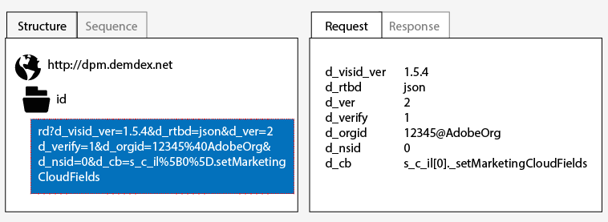
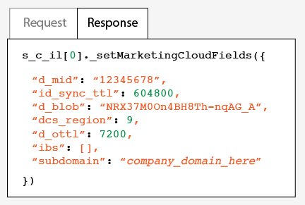
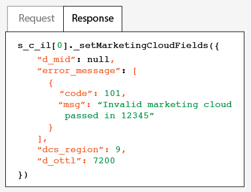

# Testare e verificare Experience Cloud Identity Service{#test-and-verify-the-experience-cloud-id-service}

Istruzioni, strumenti e procedure utili per determinare se il servizio ID funziona correttamente. Questi test sono applicabili al servizio ID in generale e per diverse combinazioni del servizio ID e delle soluzioni Experience Cloud.

## Prima di iniziare {#section-b1e76ad552ed4eb793b6e521a55127d4}

Informazioni importanti da conoscere prima di iniziare il test e la verifica del servizio ID.

**Ambienti browser**

Quando esegui il test in una sessione normale del browser, elimina la cache del browser prima di ogni test.

In alternativa puoi provare il servizio ID in una sessione browser anonima o in incognito. In una sessione anonima non è necessario cancellare i cookie o la cache del browser prima di ogni test.

**Strumenti**

Utilizzando [Adobe Debugger](https://experienceleague.adobe.com/docs/analytics/implementation/validate/debugger.html?lang=it) e il [proxy HTTP Charles](https://www.charlesproxy.com/) puoi determinare se il servizio ID è stato configurato in modo da funzionare correttamente con Analytics. Le informazioni presenti in questa sezione si basano sui risultati restituiti da Adobe Debugger e Charles. Puoi anche usare un altro strumento o debugger di tua preferenza.

## Test con Adobe Debugger {#section-861365abc24b498e925b3837ea81d469}

L&#39;integrazione del servizio è configurata correttamente se vedi un identificatore [!DNL Experience Cloud ID] (MID) nella risposta di [!DNL Adobe] Debugger. Per maggiori informazioni sull’identificatore MID, consulta [I cookie ed Experience Cloud Identity Service](../introduction/cookies.md).

Per verificare lo stato del servizio ID con il [!DNL Adobe] [debugger](https://experienceleague.adobe.com/docs/analytics/implementation/validate/debugger.html?lang=it):

1. Cancella i cookie del browser o apri una sessione di navigazione anonima.
1. Carica la pagina di prova che contiene il codice del servizio ID.
1. Apri [!DNL Adobe] Debugger.
1. Individua un identificatore MID nei risultati.

## I risultati di Adobe Debugger {#section-bd2caa6643d54d41a476d747b41e7e25}

L&#39;identificatore MID viene memorizzato in una coppia chiave-valore con sintassi: `MID= *`Experience Cloud ID`*`. Queste informazioni sono presentate nel modo seguente.

**Operazione riuscita**

Il servizio ID è stato implementato correttamente se viene visualizzata una risposta simile a questa:

```
mid=20265673158980419722735089753036633573
```

Se sei un cliente [!DNL Analytics], oltre all&#39;identificatore MID potresti vedere un identificatore [!DNL Analytics] ID (AID). Ciò si verifica:

* Con alcuni dei visitatori di lunga data del sito.
* Se hai impostato un periodo di tolleranza.

**Errore**

Contatta l’[Assistenza clienti](https://helpx.adobe.com/it/marketing-cloud/contact-support.html) se il debugger:

* Non restituisce un MID.
* Restituisce un messaggio di errore che indica che non è stato eseguito il provisioning dell’ID partner.

## Test con il proxy HTTP Charles {#section-d9e91f24984146b2b527fe059d7c9355}

Per verificare lo stato del servizio ID con Charles:

1. Cancella i cookie del browser o apri una sessione di navigazione anonima.
1. Avvia Charles.
1. Carica la pagina di prova che contiene il codice del servizio ID.
1. Verifica le chiamate di richiesta e risposta e i dati descritti di seguito.

## I risultati di Charles {#section-c10c3dc0bb9945cbaffcf6fec7082fab}

Questa sezione descrive quali informazioni cercare e dove cercarle quando usi Charles per monitorare le chiamate HTTP.

**Richieste corrette per il servizio ID in Charles**

Il codice del servizio ID funziona correttamente se la funzione `Visitor.getInstance` effettua una chiamata JavaScript a `dpm.demdex.net`. Una richiesta corretta include il tuo [ID organizzazione](../reference/requirements.md#section-a02f537129a64ffbb690d5738d360c26). L&#39;ID organizzazione viene passato sotto forma di coppia chiave-valore con sintassi: `d_orgid= *`ID organizzazione`*`. Cerca il `dpm.demdex.net` e la chiamata JavaScript nella scheda [!UICONTROL Structure]. Cerca l&#39;ID organizzazione nella scheda [!UICONTROL Request].



**Risposte corrette per il servizio ID in Charles**

Il provisioning del tuo account per il servizio ID è corretto se la risposta dai [Data Collection Servers](https://experienceleague.adobe.com/docs/audience-manager/user-guide/reference/system-components/components-data-collection.html?lang=it) (DCS) restituisce un valore MID. L’identificatore MID viene restituito come una coppia chiave-valore con sintassi: `d_mid: *`Experience Cloud ID visitatore`*`. Cerca l&#39;identificatore MID nella scheda [!UICONTROL Response], come illustrato di seguito.



**Risposte errate per il servizio ID in Charles**

Il provisioning del tuo account per il servizio ID non è corretto se la risposta DCS non contiene l&#39;identificatore MID. Una risposta errata restituisce un codice di errore e un messaggio nella scheda [!UICONTROL Response], come illustrato di seguito. Se ricevi questo messaggio di errore nella risposta DCS, contatta l’assistenza clienti.



Per ulteriori informazioni sui codici di errore, vedi [Codici di errore DCS, messaggi ed esempi](https://experienceleague.adobe.com/docs/audience-manager/user-guide/api-and-sdk-code/dcs/dcs-api-reference/dcs-error-codes.html?lang=it).

