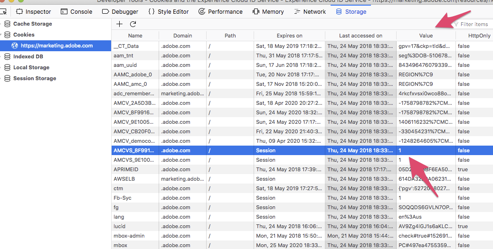

# Cookie e il servizio Experience Cloud Identity {#cookies-and-the-experience-cloud-id-service}

Il servizio ID utilizza l&#39;ID organizzazione, il cookie AMCV di Experience Cloud e il cookie demdex per creare e memorizzare identificatori univoci e costanti per i visitatori del sito. Questi cookie permettono al servizio ID di tenere traccia dei visitatori nei diversi domini e di condividere i dati tra le varie soluzioni Experience Cloud.

## Informazioni sui cookie del servizio ID {#section-f438168beaec409ab8b2cc58bd021e26}

Il servizio ID funziona correttamente se usa i cookie AMCV, AMCVS e demdex. Questi cookie sono semplicemente file che archiviano i dati usati dal servizio ID. Questi cookie del servizio ID non sono pericolosi, dannosi o diversi dagli altri cookie di prima parte o di terze parti memorizzati da un sito Web o da un servizio in un browser e seguono le stesse regole dei cookie di prima e terze parti. Per maggiori informazioni sui cookie usati dal servizio, fare riferimento alle sezioni seguenti.

### Quali sono le funzioni dei cookie del servizio ID

* Imposta e archivia un ID univoco per i visitatori del tuo sito (il MID).
* Mantieni questo ID univoco in modo che il servizio ID possa raccogliere e condividere dati con altre soluzioni Experience Cloud.
* Tracciare gli utenti nei vari domini. Tuttavia, questo richiede che tu possieda gli altri domini e che su di essi sia distribuito il codice del servizio ID.

### Quali funzioni non possono essere svolte dai cookie del servizio ID

* Archiviare, trasmettere o eseguire virus del computer.
* Accedere o archiviare informazioni personali identificabili (PII) come il tuo indirizzo e-mail.
* Controllare l’hardware o il software del computer.
* Rendere i computer instabili o causare problemi di prestazione.
* Tenere traccia degli utenti su siti che non utilizzano il servizio ID.

## Cookie AMCV {#section-c55af54828dc4cce89f6118655d694c8}

I seguenti attributi del cookie impostati dal servizio ID.

**Nome**

Il nome del cookie AMCV deve rispettare la sintassi `AMCV_<variable name>@AdobeOrg`. Nel nome, gli `<variable name>` elementi devono essere sostituiti dall&#39;ID organizzazione Experience Cloud. L&#39;ID viene inviato al DCS dalla `Visitor.getInstance` funzione nel codice del servizio ID.

Il nome completo del cookie deve essere simile al seguente:

```
AMCV_1FD6776A524453CC0A490D44%40AdobeOrg
```

**Contenuto**

Il cookie AMCV contiene l&#39;ID o il MID del visitatore di Experience Cloud. Il MID viene memorizzato in una coppia chiave/valore con sintassi `MCMID|<Experience Cloud ID>`.

La coppia chiave/valore completa deve essere simile alla seguente:

```
MCMID|20265673158980419722735089753036633573
```

Questo identificatore permanente consente la condivisione dei dati tra più soluzioni.

**Dominio**

Il cookie AMCV è impostato nel dominio di prima parte di un browser. Ciò significa che è impostato nel dominio del sito visualizzato al momento da un utente. Di conseguenza, il codice del servizio ID e altre librerie di codici Experience Cloud possono leggere il MID memorizzato nel cookie AMCV.

Tuttavia, poiché il cookie AMCV è impostato nel dominio di prima parte, non può essere utilizzato per tracciare e identificare gli utenti tra domini diversi. Al contrario, il servizio ID si basa sull’ID organizzazione e sull’ID demdex per restituire il MID corretto quando un visitatore del sito accede a un dominio diverso.

## Cookie AMCVS {#section-92a9454f1ac645948f9059b9fad928bf}

**Nome**

Il nome del cookie AMCVS deve rispettare la sintassi `AMCVS_####@AdobeOrg`. Nel nome, gli elementi #### devono essere sostituiti dall&#39;ID organizzazione Experience Cloud. L&#39;ID viene inviato al DCS dalla `theVisitor.getInstance` funzione nel codice del servizio ID.

Il nome completo del cookie deve essere simile al seguente:

```
AMCVS_1FD6776A524453CC0A490D44%40AdobeOrg
```

**Contenuto**

Il cookie AMCVS serve da flag per indicare che la sessione è stata inizializzata. Il suo valore è sempre `1` ed è discontinuo se la sessione è terminata.

**Dominio**

Il cookie AMCVS è impostato nel dominio di prima parte di un browser. Ciò significa che è impostato nel dominio del sito visualizzato al momento da un utente.



## Cookie demdex {#section-7ff7d96d6e4141b08a84a75a63d7814c}

Nella tabella seguente sono elencati e definiti alcuni attributi importanti del cookie demdex.

<table id="table_18E3CAF3550E4BB6A199736AACE39202"> 
 <thead> 
  <tr> 
   <th colname="col1" class="entry"> Attributo </th> 
   <th colname="col2" class="entry"> Descrizione </th> 
  </tr> 
 </thead>
 <tbody> 
  <tr> 
   <td colname="col1"> <p> <b>Nome</b> </p> </td> 
   <td colname="col2"> <p>Il nome del cookie è “demdex”. </p> </td> 
  </tr> 
  <tr> 
   <td colname="col1"> <p> <b>Contenuto</b> </p> </td> 
   <td colname="col2"> <p>Il cookie demdex contiene l’ID demdex, generato dal DCS. </p> </td> 
  </tr> 
  <tr> 
   <td colname="col1"> <p> <b>Dominio</b> </p> </td> 
   <td colname="col2"> <p>Il cookie demdex è impostato nel dominio di terza parte demdex.net nel browser. Questo dominio è separato dal sito visitato attualmente da un utente. </p> <p>A differenza del cookie di prima parte, il cookie AMCV, il cookie demdex e l’ID restano costanti nei diversi domini. L’ID demdex e l’ID organizzazione sono i valori comuni che consentono al servizio ID di restituire e identificare un visitatore del sito con l’ID visitatore corretto. </p> </td> 
  </tr> 
 </tbody> 
</table>

Per informazioni correlate, consulta [Informazioni sulle chiamate al dominio Demdex](https://docs.adobe.com/content/help/it-IT/audience-manager/user-guide/reference/demdex-calls.html).

## Generazione dell&#39;Experience Cloud ID {#section-15f69c0bac394b4b9966a23fbc586d17}

L&#39;Experience Cloud ID (MID) viene derivato matematicamente dall&#39;ID organizzazione e dall&#39;ID demdex. Fintanto che questi ID restano costanti la generazione del MID corretto per un utente specifico è semplicemente un problema matematico. Con lo stesso ID organizzazione e lo stesso ID demdex si ottiene sempre lo stesso valore MID. Questo consente al servizio ID di tenere traccia dei visitatori tra i domini che controlli e che hai configurato con il codice del servizio ID.

Il servizio ID inizia a creare un MID non appena la tua pagina viene caricata. Durante il processo, il codice fornito dalla `visitorAPI.js` libreria di codici invia l&#39;ID organizzazione in una chiamata evento al servizio ID. Il servizio ID crea e restituisce il MID e un ID demdex, rispettivamente, nei cookie AMCV e demdex.

## Flag per cookie

La tabella seguente descrive i flag per i cookie Experience Cloud:

| Cookie (impostato da) | httpOnly | Secure | SameSite |
|--- |--- |--- |--- |
| demdex (risposta http) | No | Sì | “Nessuno” |
| AMCV (JavaScript) | No | Configurabile | Non impostato (impostazione predefinita Lax) |
| AMCVS (JavaScript) | No | Configurabile | Non impostato (impostazione predefinita Lax) |

*Nota: Per informazioni sulla configurazione del cookie AMCV e AMCVS con attributi sicuri, consulta l’argomento relativo a [secureCookie](https://docs.adobe.com/content/help/it-IT/id-service/using/id-service-api/configurations/securecookie.html).*

## Passaggi successivi {#section-8db1727a63bc4ff68b495f270315d453}

Consulta [Richiesta e impostazione degli ID da parte del servizio Experience Cloud Identity...](../introduction/id-request.md#concept-2caacebb1d244402816760e9b8bcef6a).
