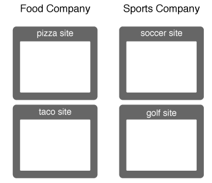
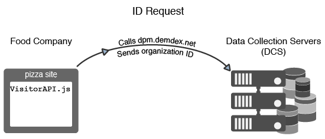
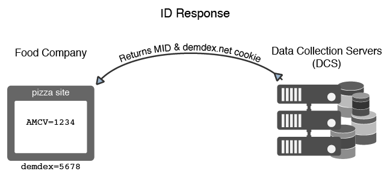
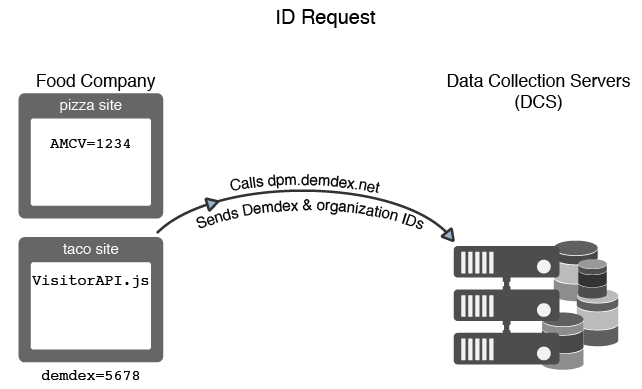
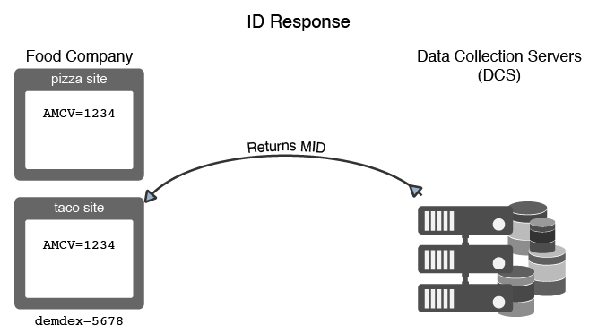
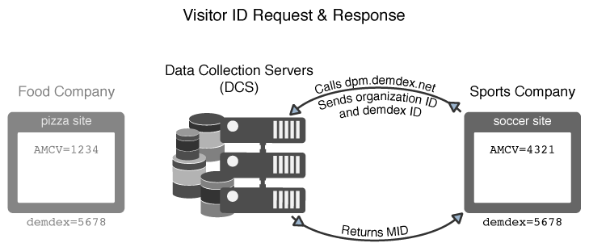

# Richiesta e impostazione degli ID da parte del servizio ID visitatore di Adobe{#how-the-experience-cloud-id-service-requests-and-sets-ids}

Panoramica del processo di richiesta ID e risposta. Questi esempi descrivono l&#39;assegnazione degli ID per siti individuali, per siti diversi e per siti gestiti da diversi clienti CX Enterprise con i propri ID organizzazione IMS.

>[!NOTE]
>
>Se non sai in che modo il Servizio ID visitatore crea l&#39;ID visitatore, consulta la sezione [Cookie e il Servizio ID visitatore](../introduction/cookies.md).

## Richiesta di un ECID {#section-0b5e261fbd0547d9b9a1680e5ce536cc}

Gli esempi seguenti mostrano come il Servizio ID visitatore richiede e riceve l’ECID. Negli esempi vengono utilizzate due società fittizie, l&#39;Azienda alimentare e l&#39;Azienda sportiva, per illustrare il flusso dei dati per le richieste e le risposte relative agli ID. Ogni azienda ha un ID organizzazione IMS univoco e ha implementato il codice del servizio ID visitatore su tutti i suoi siti. Questi casi d’uso rappresentano flussi di dati per un’implementazione generica del Servizio ID visitatore senza Analytics, ID legacy o browser che bloccano i cookie di terze parti.

**Prima richiesta**

In questo esempio, un nuovo visitatore accede al sito pizzeria gestito dalla società Azienda alimentare. La società Azienda alimentare ha il codice del servizio ID visitatore sul sito Web pizzeria. Quando il sito pizzeria viene caricato, il codice del servizio ID visitatore controlla la presenza del cookie AMCV nel dominio pizzeria.

* Se il cookie AMCV è impostato, il visitatore del sito dispone di un ECID. In questo caso, il cookie tiene traccia del visitatore e condivide i dati con altre soluzioni CX Enterprise.
* Se il cookie AMCV non è impostato, il codice del servizio ID visitatore chiama un [server di raccolta dati](https://experienceleague.adobe.com/docs/analytics/technotes/rdc/regional-data-collection.html?lang=it) (DCS) regionale in `dpm.demdex.net/id` (vedi anche [Informazioni sulle chiamate al dominio demdex](https://experienceleague.adobe.com/docs/audience-manager/user-guide/reference/demdex-calls.html?lang=it). La chiamata include l’ID organizzazione IMS per la società Azienda alimentare. L&#39;ID organizzazione IMS è impostato nella funzione `Visitor.getInstance` del codice del servizio ID visitatore.

**Prima risposta**

Nella risposta, il DCS restituisce l’ECID e il cookie demdex. Il codice del servizio ID visitatore scrive il valore MID nel cookie AMCV. Ad esempio, supponiamo che il DCS restituisca un valore MID pari a 1234. Il viene memorizzato nel cookie AMCV come `mid|1234`mid| e viene impostato nel dominio pizzeria di prime parti. Il cookie demdex contiene a sua volta un ID univoco (chiamiamolo 5678). Questo cookie è impostato nel dominio demdex.net di terze parti, separato dal dominio pizzeria.

Come vedrai nel prossimo esempio, l’ID demdex e l’ID organizzazione IMS consentono al servizio ID visitatore di creare e restituire il MID corretto quando il visitatore si sposta su un altro sito appartenente alla società Azienda alimentare.

## Richieste e risposte intersito {#section-15ea880453af467abd2874b8b4ed6ee9}

In questo esempio, il visitatore della società Azienda alimentare accede al sito taqueria dal sito pizzeria. La società Azienda alimentare ha il codice del servizio ID visitatore sul sito Web taqueria. Il visitatore non è mai stato sul sito Web taqueria.

Date queste condizioni, sul sito taqueria non ci sono cookie AMCV. Inoltre, il servizio ID visitatore non può utilizzare il cookie AMCV impostato sul sito pizzeria perché è specifico per il dominio pizzeria. Di conseguenza, il Servizio ID visitatore deve chiamare il DCS per verificare e richiedere un ID visitatore. In questo caso, la chiamata al DCS include l&#39;ID organizzazione IMS *e* della società Azienda alimentare l&#39;ID demdex. Ricorda che l’ID demdex viene prelevato dal sito pizzeria e memorizzato come cookie di terze parti nel dominio demdex.net.

Dopo che il DCS riceve l’ID organizzazione IMS e l’ID demdex, crea e restituisce il MID corretto per il visitatore del sito. Poiché il viene derivato matematicamente dall&#39;ID organizzazione IMS e dall&#39;ID demdex, il cookie AMCV contiene il valore MID, `mid = 1234`.

## Richieste di ID da altri siti {#section-ba9a929e50d64b0aba080630fd83b6f1}

In questo esempio, il visitatore abbandona i siti della società Azienda alimentare e accede al sito di calcio di proprietà della società Azienda sportiva. Quando il visitatore accede al sito di calcio, il processo di verifica e richiesta degli ID funziona nel modo descritto negli esempi precedenti. Tuttavia, poiché la società Azienda sportiva ha il proprio ID organizzazione IMS, il servizio ID visitatore restituisce un MID diverso. Il nuovo MID è univoco per i domini controllati dalla società Azienda sportiva e consente alla società di monitorare e condividere i dati dei visitatori tra le soluzioni CX Enterprise. L&#39;ID demdex del visitatore rimane invariato, perché è contenuto in un cookie di terze parti e viene mantenuto nei diversi domini.

