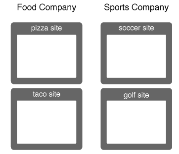

# Richiesta e impostazione degli ID da parte del servizio Experience Cloud Identity {#how-the-experience-cloud-id-service-requests-and-sets-ids}

Panoramica del processo di richiesta ID e risposta. Questi esempi descrivono l&#39;assegnazione degli ID per siti individuali, per siti diversi e per siti gestiti da diversi clienti Experience Cloud con i propri ID organizzazione.

>[!NOTE]
>
>Se non sai in che modo il servizio Experience Cloud Identity crea l’ID visitatore, consulta la sezione [Experience Cloud](../introduction/cookies.md).

**Suggerimento:** guarda anche il nostro [video del servizio ID sul tracciamento su più domini](https://helpx.adobe.com/it/marketing-cloud-core/kb/MCID/CrossDomain.html).

## Richiesta di un Experience Cloud ID {#section-0b5e261fbd0547d9b9a1680e5ce536cc}

Nei seguenti esempi viene spiegato in che modo il servizio ID richiede e riceve l&#39;ID visitatore di Experience Cloud. Negli esempi vengono utilizzate due società fittizie, l&#39;Azienda alimentare e l&#39;Azienda sportiva, per illustrare il flusso dei dati per le richieste e le risposte relative agli ID. Per ciascuna società è presente un ID organizzazione Experience Cloud univoco e ciascuna di esse ha implementato il codice del servizio ID su tutti i propri siti. Questi casi d’uso rappresentano i flussi di dati per un’implementazione generica del servizio ID senza Analytics, ID legacy o browser che bloccano i cookie di terze parti.

**Prima richiesta**

In questo esempio, un nuovo visitatore accede al sito pizzeria gestito dalla società Azienda alimentare. La società Azienda alimentare ha il codice del servizio ID sul sito Web pizzeria. Quando il sito pizzeria viene caricato, il codice del servizio ID verifica la presenza del cookie AMCV nel dominio pizzeria.

* Se il cookie AMCV è impostato, il visitatore del sito dispone di un Experience Cloud ID. In questo caso, il cookie monitora il visitatore e condivide i dati con altre soluzioni Experience Cloud.
* Se il cookie AMCV non è impostato, il codice del servizio ID chiama un [server di raccolta dati](https://experienceleague.adobe.com/docs/analytics/technotes/rdc/regional-data-collection.html?lang=it) regionale (DCS) in `dpm.demdex.net/id` (vedi anche, [Informazioni sulle chiamate al dominio demdex](https://experienceleague.adobe.com/docs/audience-manager/user-guide/reference/demdex-calls.html?lang=it). La chiamata include l&#39;ID organizzazione della società Azienda alimentare. L&#39;ID organizzazione viene impostato nella funzione `Visitor.getInstance` del codice del servizio ID.

**Prima risposta**

All&#39;interno della risposta, il DCS restituisce l&#39;[!DNL Experience Cloud] ID (MID) e il cookie demdex. Il codice del servizio ID scrive il valore MID nel cookie AMCV. Ad esempio, supponiamo che il DCS restituisca un valore MID pari a 1234. Il viene memorizzato nel cookie AMCV come `mid|1234`mid| e viene impostato nel dominio pizzeria di prime parti. Il cookie demdex contiene a sua volta un ID univoco (chiamiamolo 5678). Questo cookie è impostato nel dominio demdex.net di terze parti, separato dal dominio pizzeria.

Come vedrai nel prossimo esempio, l’ID demdex e l’ID organizzazione consentono al servizio ID di creare e restituire il MID corretto quando il visitatore si sposta in un altro sito appartenente alla società Azienda alimentare.

## Richieste e risposte intersito {#section-15ea880453af467abd2874b8b4ed6ee9}

In questo esempio, il visitatore della società Azienda alimentare accede al sito taqueria dal sito pizzeria. La società Azienda alimentare ha il codice del servizio ID sul sito Web taqueria. Il visitatore non è mai stato sul sito Web taqueria.

Date queste condizioni, sul sito taqueria non ci sono cookie AMCV. Inoltre, il servizio ID non può utilizzare il cookie AMCV impostato sul sito pizzeria perché è specifico per il dominio pizzeria. Di conseguenza, il servizio ID deve chiamare il DCS per verificare e richiedere un ID visitatore. In questo caso, la chiamata al DCS include l’ID organizzazione della società Azienda alimentare *e* l’ID demdex. Ricorda che l’ID demdex viene prelevato dal sito pizzeria e memorizzato come cookie di terze parti nel dominio demdex.net.

Il DCS, dopo aver ricevuto l’ID organizzazione e l’ID demdex, crea e restituisce il MID corretto per il visitatore del sito. Poiché il viene derivato matematicamente dall&#39;ID organizzazione e dall&#39;ID demdex, il cookie AMCV contiene il valore MID, `mid = 1234`.

## Richieste di ID da altri siti {#section-ba9a929e50d64b0aba080630fd83b6f1}

In questo esempio, il visitatore abbandona i siti della società Azienda alimentare e accede al sito di calcio di proprietà della società Azienda sportiva. Quando il visitatore accede al sito di calcio, il processo di verifica e richiesta degli ID funziona nel modo descritto negli esempi precedenti. Tuttavia, poiché la società Azienda sportiva dispone di un proprio ID organizzazione, il servizio ID restituisce un MID diverso. Il nuovo MID è univoco per i domini controllati dalla società Azienda sportiva e consente alla società di monitorare e condividere i dati del visitatore tra le soluzioni [!DNL Experience Cloud]. L&#39;ID demdex del visitatore rimane invariato, perché è contenuto in un cookie di terze parti e viene mantenuto nei diversi domini.

